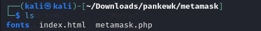

# GrabThePhisher Lab

> **Category:** Threat Intel  
**Tactics:** Initial Access, Exfiltration 
**Tools:** Text Editor
---

## Scenario:
A decentralized finance (DeFi) platform recently reported multiple user complaints about **unauthorized fund withdrawals**. A **forensic review uncovered a phishing site impersonating the legitimate PancakeSwap exchange, luring victims into entering their wallet seed phrases**. The phishing kit was hosted on a compromised server and exfiltrated credentials **via a Telegram bot**.

Your task is to **conduct threat intelligence analysis on the phishing infrastructure, identify indicators of compromise (IoCs)**, and track the attacker’s online presence, including aliases and Telegram identifiers, to **understand their tactics, techniques, and procedures (TTPs)**.

## Investigation Process
### Identifying the Wallet Targeted
Given the nature of the attack, it was evident that the phishing attempt targeted cryptocurrency wallets. The presence of Metamask in the collected evidence suggested that it was the primary wallet used in this scam. Metamask is a well-known wallet that facilitates buying, exchanging, and selling cryptocurrencies, making it a prime target for phishing attacks.

Upon extracting the contents of the `95-GrabThePhisher.zip` file, a folder named `pankewk` was found, which contained a directory labeled `metamask`.

Filtering for the keyword **wallet** within this directory revealed three key files: `metamask.php`, `index.html`, and a `fonts` directory. 

Using the pipe and grep command, I confirmed that the term **wallet** appeared in the `index.html` file. This indicated that Metamask was being used as the wallet for harvesting seed phrases.

Opening `index.html` in a browser confirmed that the site prompted users to enter their seed phrases with the text: **"Continue with the Seed Phrase."** This confirmed that the phishing site was designed to harvest wallet credentials.

---

### Answers to Key Questions:
**Q1. Which wallet is used for asking the seed phrase?**  
Metamask was the wallet used for requesting seed phrases from victims.

**Q2. What is the file name that has the code for the phishing kit?**  

The `metamask.php` file contained the phishing kit’s code. It was designed to redirect victims to the `index.html` page, making the site appear legitimate while secretly harvesting seed phrases.

**Q3. In which language was the kit written?**  

The kit was written in **PHP** (Hypertext Preprocessor), a scripting language used to create dynamic web pages. It is open-source and embedded within HTML.

**Q4. What service does the kit use to retrieve the victim's machine information?**  

The phishing kit used **Sypex Geo**

A tool for determining location by IP address. Sypex Geo provides information about the visitor’s location, including country, region, city, and geographic coordinates. The attacker used this tool to gather victim details.

**Q5. How many seed phrases were already collected?**  

By navigating to the `log` directory, a file named `log.txt` was found. Opening it in the terminal revealed three lines of phrases. Since a Metamask seed phrase consists of 12 words, this indicated that **three victims** had already been compromised.

**Q6. Could you please provide the seed phrase associated with the most recent phishing incident?**  

`father also recycle embody balance concert mechanic believe owner pair muffin hockey`

**Q7. Which medium was used for credential dumping?**  

The phishing kit exfiltrated credentials via a **Telegram bot**. This was confirmed in the `metamask.php` file, where the bot’s command was present.

**Q8. What is the token for accessing the channel?** 

`5457463144:AAG8t4k7e2ew3tTi0IBShcWbSia0IGontservxm10-Please don't check the Bot as this was just a Lab practice, not intended for any harm`

**Q9. What is the Chat ID for the phisher's channel?**  

`5442785564`

**Q10. What are the allies of the phish kit developer?**  

`j1j1b1s@m3r0`. This was found in a message where the developer signed off with “Regards.”

**Q11. What is the full name of the Phish Actor?** 

By analyzing the `metamask.php` file and following the Telegram bot’s API URL, the actor responsible for the phishing attack was identified.

`//api.telegram.org/bot5457463144:AAG8t4k7e2ew3tTi0IBShcWbSia0Irvxm10/getChat?chat_id=5442785564'

**Q12. What is the username of the Phish Actor?**  

`Pumpkinboii`, as retrieved from the Telegram API response.

---

## Breakdown of the Attack Vector:
1. **Phishing Tactic:**
   - The attacker impersonated **PancakeSwap**, a legitimate DeFi exchange.
   - Sent **phishing emails** to lure victims.
   - Used a **fraudulent Metamask login page** to steal seed phrases.

2. **Technical Implementation:**
   - Embedded **PHP scripts** in `index.html`.
   - Used **Sypex Geo** to collect victims’ IP addresses and geographical locations.
   - Logged **seed phrases** for unauthorized access to wallets.

3. **Flaws in the Attack:**
   - The phishing email contained a **username**, which helped trace the attacker.
   - The hosted site **leaked identifiable information** (name, last name, and username).
   - These flaws allowed for **further OSINT (Open-Source Intelligence) investigation** to uncover the attacker’s identity.

--- 

## Lessons and Preventive Measures:
After analyzing **Marcus Aurelius’ phishing attack**, it’s clear that awareness and preventive measures are key to stopping such threats. To prevent future attacks:

- **User Education:** Teach users about phishing techniques and risks.
- **Enforce Security Best Practices:** Ensure users recognize phishing red flags.
- **Strengthen Defenses:** Implement monitoring and security layers to detect suspicious activity.

### MetaMask’s Security Recommendations:
- **Never share your seed phrase**—not even with MetaMask staff.
- **If you lose your seed phrase, nobody can recover it for you. Store it securely.**

### Best Ways to Store a Seed Phrase Securely:
1. **Write it down** and keep it in a secure location.
2. **Never store it digitally** (avoid emails, notes, or screenshots).

---

### Final Thoughts:
This investigation was both fun and insightful, allowing for critical thinking about cybersecurity threats and solutions. Cybersecurity is an ongoing battle, but with the right approach, we can reduce risk and prevent attackers like **Marcus Aurelius** from succeeding. Staying informed and vigilant is key.  

**Thank You.x0x0 .7@i**
